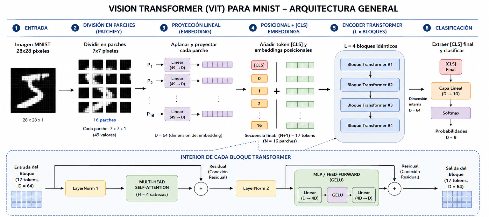

# Vision Transformer (ViT) en C++ — Clasificación de MNIST

**Autores:** Arleen Ferro, Cristhian Huanca, Wilson Mamani

Este repositorio contiene una implementación de un **Vision Transformer (ViT)** desarrollada en **C++17** (con soporte opcional para aceleración por GPU mediante **CUDA**). 

El proyecto fue diseñado sin dependencias de librerías externas de Machine Learning (como PyTorch o TensorFlow). Su propósito principal es ilustrar cómo operan internamente los motores de cálculo tensorial, la diferenciación automática (Backpropagation) y la arquitectura Transformer.

---

## Arquitectura del Modelo (Vision Transformer)

A diferencia de las Redes Neuronales Convolucionales (CNN) clásicas, que procesan imágenes píxel por píxel buscando patrones locales, el Vision Transformer trata a la imagen de manera similar a como un modelo de lenguaje procesa texto.

La arquitectura sigue este flujo de procesamiento:


1. **División en Parches (Patchify):** La imagen de entrada (28x28 píxeles en el caso de MNIST) se divide en cuadrículas pequeñas, por ejemplo, parches de 7x7.
2. **Proyección Lineal (Embedding):** Cada parche se aplana y se pasa por una capa lineal para convertirlo en un vector numérico representativo (embedding).
3. **Información Posicional:** Como el modelo no procesa los parches en un orden espacial estricto, se le suma una "etiqueta posicional" a cada vector para que la red sepa en qué lugar de la imagen original iba ese parche.
4. **Bloques Transformer:** Los vectores pasan a través de múltiples bloques idénticos (por defecto 4). Cada bloque contiene:
   - **Multi-Head Self-Attention (Atención):** Permite que la red analice la relación entre diferentes parches de la imagen, sin importar qué tan lejos estén unos de otros.
   - **Perceptrón Multicapa (MLP):** Procesa la información extraída por la capa de atención.
   - **Normalización (LayerNorm) y Conexiones Residuales:** Aseguran que el entrenamiento sea estable.
5. **Clasificación:** Al final, se extrae la información consolidada en un token especial (llamado `[CLS]`) y se pasa por una última capa lineal para decidir a qué dígito (del 0 al 9) corresponde la imagen.

### Principales Operaciones Matemáticas

En esta sección presentamos las fórmulas matemáticas más críticas que se han programado en el código:

**1. Mecanismo de Atención (Self-Attention)**
El núcleo del Transformer. Calcula qué parches de la imagen deben "prestarse atención" mutuamente cruzando Queries ($Q$), Keys ($K$) y Values ($V$):

$$
\text{Atención}(Q, K, V) = \text{softmax}\left(\frac{Q K^\top}{\sqrt{d_k}}\right) V
$$

**2. Función de Pérdida (Cross-Entropy)**
Mide qué tan equivocada estuvo la predicción del modelo ($y$ es la etiqueta correcta):

$$
\mathcal{L} = -\log(\text{probs}_y)
$$

**3. Autograd Manual (Backpropagation)**
Para que la red aprenda, se calcularon las derivadas a mano en `ops.hpp`. Por ejemplo, para propagar el error $\bar{Y}$ a través de una multiplicación de matrices $Y = XW$:

$$
\bar{W} = X^\top \bar{Y} \quad \text{y} \quad \bar{X} = \bar{Y} W^\top
$$

**4. Optimizador AdamW**
Mientras el Autograd (Backpropagation) calcula *hacia dónde* ajustar los pesos, Adam decide matemáticamente *cuánto* ajustarlos. Utiliza un promedio de gradientes pasados (Momentum) para tomar impulso, y frena los cambios demasiado bruscos observando la varianza. La actualización de un parámetro $\theta$ se calcula como:

$$
\theta_t = \theta_{t-1} - \eta \frac{\hat{m}_t}{\sqrt{\hat{v}_t} + \epsilon} - \eta \lambda_{\text{wd}} \theta_{t-1}
$$

---

## Estructura del Código

El código fuente está modularizado de forma lógica para separar las matemáticas base de la lógica de la red neuronal:

- `include/tensor.hpp`: Implementa la estructura fundamental `Tensor`. Es el bloque de construcción del proyecto; almacena los datos numéricos, los gradientes y la información para construir el grafo de dependencias de operaciones.
- `include/ops.hpp`: Contiene las operaciones matemáticas elementales (suma, multiplicación de matrices, softmax, etc.). Aquí se programa de forma manual la derivada matemática (regla de la cadena) de cada operación para hacer posible el aprendizaje.
- `include/nn.hpp`: Define las capas de la red neuronal basándose en las operaciones anteriores. Incluye implementaciones de la Capa Lineal, Normalización, Atención y el Bloque Transformer completo.
- `include/vit.hpp`: Ensambla las capas previamente definidas para construir la arquitectura completa del Vision Transformer. También maneja el guardado y carga del modelo.
- `include/optimizer.hpp`: Implementa el algoritmo de optimización **Adam**, encargado de actualizar los pesos de la red neuronal utilizando los gradientes calculados.
- `src/train.cpp` y `src/eval.cpp`: Los programas principales que orquestan el ciclo de entrenamiento y la evaluación (inferencia) sobre el dataset de prueba.
- `scripts/`: Contiene utilidades auxiliares, como el script en Python para descargar y preparar los datos de MNIST.

---

## Requisitos y Compilación

Para compilar el proyecto, necesitas un compilador compatible con C++17 (como `g++`, `clang++` o MSVC). 

### Usando CMake (Estándar)
Si tienes CMake instalado, es la manera más robusta:
```bash
mkdir build
cd build
cmake .. -DCMAKE_BUILD_TYPE=Release
cmake --build . --config Release
```

## Preparación de los Datos

El modelo utiliza el dataset clásico MNIST (imágenes de números escritos a mano). Para descargar y preparar automáticamente los archivos binarios, ejecuta el script de Python incluido:

```bash
python scripts/download_data.py
```
Esto creará una carpeta `data/` y colocará allí los archivos descomprimidos listos para ser consumidos por el programa.

---

## Uso y Entrenamiento

Una vez compilado el código y descargados los datos, puedes comenzar a entrenar el modelo ejecutando:

```bash
./build/vit_train.exe --train-images data/train-images-idx3-ubyte --train-labels data/train-labels-idx1-ubyte --test-images data/t10k-images-idx3-ubyte --test-labels data/t10k-labels-idx1-ubyte --epochs 10
```

Durante el entrenamiento, el programa informará del progreso en cada época (pérdida y precisión) y guardará los pesos del modelo (`.bin`) de manera automática si se presenta una mejora.

Para evaluar un modelo previamente entrenado, puedes utilizar el programa de evaluación:

```bash
./build/vit_eval.exe --model models/vit_mnist.bin --test-images data/t10k-images-idx3-ubyte --test-labels data/t10k-labels-idx1-ubyte
```

---

## Resultados y Análisis

A continuación, se presentan los resultados obtenidos tras entrenar el modelo en el dataset MNIST completo (60,000 imágenes) durante 10 épocas, utilizando el optimizador AdamW (tasa de aprendizaje ajustada y $\lambda=0.01$):

| Época | Pérdida (Train) | Precisión (Train) | Pérdida (Test) | Precisión (Test) | Tiempo (s) |
|:---:|:---:|:---:|:---:|:---:|:---:|
| 1 | 0.41297 | 87.25% | 0.18127 | 94.63% | 907.25 |
| 2 | 0.14804 | 95.55% | 0.12477 | 96.23% | 903.93 |
| 3 | 0.10344 | 96.88% | 0.11616 | 96.58% | 863.49 |
| 4 | 0.07819 | 97.62% | 0.10024 | 96.88% | 872.27 |
| 5 | 0.06084 | 98.08% | 0.10441 | 96.70% | 810.01 |
| 6 | 0.05127 | 98.39% | 0.08956 | 97.30% | 792.08 |
| 7 | 0.04106 | 98.70% | 0.09187 | 97.47% | 805.22 |
| 8 | 0.03573 | 98.84% | 0.09313 | 97.30% | 800.04 |
| 9 | 0.03132 | 98.96% | 0.08784 | **97.64%** | 801.10 |
| 10 | 0.02594 | 99.16% | 0.10536 | 97.08% | 794.68 |

**Análisis de los Resultados:**
1. **Convergencia Exitosa:** El modelo aprende de manera fluida y estable. La pérdida de entrenamiento (train loss) baja constantemente desde 0.41 hasta casi 0.02, lo que demuestra que nuestra implementación manual del **Grafo Computacional y Backpropagation** es matemáticamente correcta.
2. **Excelente Precisión:** Alcanzar un **97.64%** de precisión en el conjunto de pruebas (test) en la época 9 es un resultado sumamente destacable para una red escrita enteramente desde cero en C++.
3. **Comportamiento Esperado (Overfitting):** Hacia la época 10, podemos observar cómo la pérdida en las pruebas (test loss) sufre un ligero repunte (de 0.087 a 0.105), mientras que la precisión de entrenamiento sigue subiendo. Este es el comportamiento clásico de un ligero sobreajuste (overfitting), demostrando que la red tiene capacidad suficiente para memorizar el dataset y nos indica que la época 9 es el punto óptimo para detener el entrenamiento.
